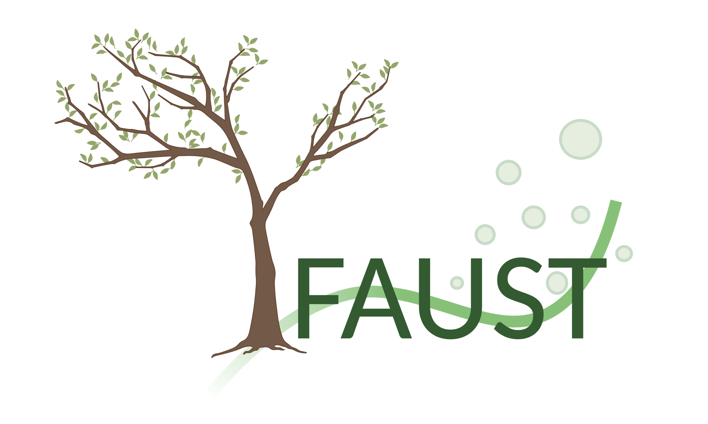

# Overview

This repo contains a `Nextflow` implementation of the `FAUST` statistical method.

`FAUST` will provide automated unsupervised clustering selection within popular data sets such as Flow Cytometry, Mass Cytometry, and is compatible with many other domain specific data sets!

`FAUST` is an amazing new machine learning technique that will help create higher quality analysis of data sets by using brand new techniques likes bootstrapping decision trees without annotations, unsupervised clustering selection, and can scale with respect to desired deployment architecture.

## Explain Like I'm 5

-   🧰This repository is a workflow that can be used by a software tool called `Nextflow`.
-   ⚒️This workflow takes a data set of any size and processes it using a statistical method called `FAUST`.
-   🔥💯🤩`FAUST` will automatically select interesting groups within the data set and provide files back to tell you about those groups.
-   🔥💯😌`FAUST` will identify groups that humans normally would not see, and as a result removes the potential for human error in processing a data set for analysis.
-   🔥💯💵`FAUST` also removes the overhead of a human having to process a data set, which saves time and money on processing for analysis.

# Table of Contents

<!-- START doctoc generated TOC please keep comment here to allow auto update -->
<!-- DON'T EDIT THIS SECTION, INSTEAD RE-RUN doctoc TO UPDATE -->

-   [Repository Structure](#repository-structure)
-   [FAUST Commands](#faust-commands)
    -   [`generate_annotations`](#generate_annotations)
    -   [`discover_phenotypes`](#discover_phenotypes)
-   [Quick Start - Local Execution](#quick-start---local-execution)
    -   [Create the FAUST input requirements](#create-the-faust-input-requirements)
    -   [Run `FAUST` using the local configurations](#run-faust-using-the-local-configurations)
        -   [Template Example](#template-example)
        -   [Actual Example](#actual-example)
    -   [Wait for processing to complete](#wait-for-processing-to-complete)
    -   [Collect results from the `FAUST_RESULTS` directory](#collect-results-from-the-faust_results-directory)
-   [Quick Start - Amazon Web Services(AWS) Execution](#quick-start---amazon-web-servicesaws-execution)
    -   [Create the FAUST input requirements](#create-the-faust-input-requirements-1)
    -   [Create AWS Infrastructure](#create-aws-infrastructure)
    -   [Run `FAUST` using the AWS configurations](#run-faust-using-the-aws-configurations)
        -   [Template Example](#template-example-1)
        -   [Actual Example](#actual-example-1)
    -   [Wait for processing to complete](#wait-for-processing-to-complete-1)
    -   [Collect results from the `FAUST_RESULTS` directory](#collect-results-from-the-faust_results-directory-1)
-   [Additional Documentation](#additional-documentation)
    -   [User Oriented Information](#user-oriented-information)
    -   [Developer Oriented Information](#developer-oriented-information)

<!-- END doctoc generated TOC please keep comment here to allow auto update -->

# Repository Structure

| Name                                                   | Description                                                                                                                                                                            |
| ------------------------------------------------------ | -------------------------------------------------------------------------------------------------------------------------------------------------------------------------------------- |
| [continuous_integration/](continuous_integration/)     | This is the directory that contains all the required files to make `FAUST` Nextflow available for everyone. Users of `FAUST`'s Nextflow implementation should not need to look in here |
| [documentation/](documentation/)                       | This is all the documentation for `FAUST Nextflow`                                                                                                                                     |
| [faust_r_lib/](faust_r_lib/)                           | This is a one off implementation of `FAUST` in order to simplify supporting `Nextflow`                                                                                                 |
| [.gitignore](.gitignore)                               | Files to ignore in this repo                                                                                                                                                           |
| [Makefile](Makefile)                                   | Simple commands to help simplify interacting with this repository                                                                                                                      |
| [README.md](README.md)                                 | This the quick-start document for `FAUST Nextflow`                                                                                                                                     |
| [aws_batch_nextflow.config](aws_batch_nextflow.config) | This is the configuration file for `FAUST Nextflow` with AWS Batch                                                                                                                     |
| [local_nextflow.config](local_nextflow.config)         | This is the configuration file for `FAUST Nextflow` with AWS Batch                                                                                                                     |
| [main.nf](main.nf)                                     | This is the `Nextflow` script for `FAUST`                                                                                                                                              |
| [nextflow](nextflow)                                   | This is a static version of the `Nextflow` tool                                                                                                                                        |

# FAUST Commands

FAUST has multiple commands. Only one command can be specified during execution.

## `generate_annotations`

The `generate_annotations` command will perform `FAUST` only up to the `grow annotation forest` step of `FAUST`. It will not perform discovery.

This command is to speed up and enable tuning `FAUST` parameters for the `discover_phenotypes` command

## `discover_phenotypes`

The `discover_phenotypes` command is the full execution of `FAUST` by default it will perform a best effort analysis of the provided data, but if that does not provide the desired results tuning via parameters will need to be performed.

# Quick Start - Local Execution

## Create the FAUST input requirements

1. Create the input gating set
    1. First get a data set that you'd like to process
    1. Pre-process this data set
        - Convert it into a gating set
        - Gate out doublets
        - Gate out live/dead cells
    1. Convert this gating set into an `R` `FlowWorkspace` gating set and save it
    1. Save the gating set to a directory
1. Create an `active channels file`
    - See the [documentation/HOW_TO_USE_FAUST_NEXTFLOW.md `active channels file`](documentation/HOW_TO_USE_FAUST_NEXTFLOW.md#active-channels-file) section for more information
1. Create a `channel bounds file`
    - See the [documentation/HOW_TO_USE_FAUST_NEXTFLOW.md `channel bounds file`](documentation/HOW_TO_USE_FAUST_NEXTFLOW.md#channel-bounds-file) section for more information
1. Create a `supervised list file`
    - See the [documentation/HOW_TO_USE_FAUST_NEXTFLOW.md `supervised list file`](documentation/HOW_TO_USE_FAUST_NEXTFLOW.md#supervised-list-file) section for more information

## Run `FAUST` using the local configurations

### Template Example

-   ⚠️ **Warning** Execute this using the `nextflow run` command, or execute this from repository's root directory
-   `generate_annotations`
    -   ```bash
        ./nextflow run main.nf -profile local \
                                --active_channels_path [PATH_TO_ACTIVE_CHANNELS_RDS_FILE] \
                                --channel_bounds_path [PATH_TO_CHANNEL_BOUNDS_RDS_FILE] \
                                --supervised_list_path [PATH_TO_SUPERVISED_LIST_RDS_FILE] \
                                --input_gating_set_directory [PATH_TO_A_DIRECTORY_CONTAINING_FLOW_WORKSPACE_GATING_SET_FILES] \
                                --command generate_annotations
        ```
-   `discover_phenotypes`
    -   ```bash
        ./nextflow run main.nf -profile local \
                                --active_channels_path [PATH_TO_ACTIVE_CHANNELS_RDS_FILE] \
                                --channel_bounds_path [PATH_TO_CHANNEL_BOUNDS_RDS_FILE] \
                                --supervised_list_path [PATH_TO_SUPERVISED_LIST_RDS_FILE] \
                                --input_gating_set_directory [PATH_TO_A_DIRECTORY_CONTAINING_FLOW_WORKSPACE_GATING_SET_FILES] \
                                --command discover_phenotypes
        ```

### Actual Example

-   `generate_annotations`
    -   ```bash
        ./nextflow run main.nf -profile local \
                                --active_channels_path ~/Desktop/nextflow_testing/helper_files/active_channels.rds \
                                --channel_bounds_path ~/Desktop/nextflow_testing/helper_files/channel_bounds.rds \
                                --supervised_list_path ~/Desktop/nextflow_testing/helper_files/supervised_list.rds \
                                --input_gating_set_directory ~/Desktop/nextflow_testing/dataset \
                                --command generate_annotations
        ```
-   `discover_phenotypes`
    -   ```bash
        ./nextflow run main.nf -profile local \
                                --active_channels_path ~/Desktop/nextflow_testing/helper_files/active_channels.rds \
                                --channel_bounds_path ~/Desktop/nextflow_testing/helper_files/channel_bounds.rds \
                                --supervised_list_path ~/Desktop/nextflow_testing/helper_files/supervised_list.rds \
                                --input_gating_set_directory ~/Desktop/nextflow_testing/dataset \
                                --command discover_phenotypes
        ```

## Wait for processing to complete

`FAUST Nextflow` will be processing at this point, please wait for it to complete.

## Collect results from the `FAUST_RESULTS` directory

This is generated at the end of the `FAUST Nextflow`'s execution

# Quick Start - Amazon Web Services(AWS) Execution

This is how you can run `FAUST Nextflow` using AWS Resources

## Create the FAUST input requirements

1. Create the input gating set
    1. First get a data set that you'd like to process
    1. Pre-process this data set
        - Convert it into a gating set
        - Gate out doublets
        - Gate out live/dead cells
    1. Convert this gating set into an `R` `FlowWorkspace` gating set and save it
    1. Save the gating set to a directory
1. Create an `active channels file`
    - See the [documentation/HOW_TO_USE_FAUST_NEXTFLOW.md `active channels file`](documentation/HOW_TO_USE_FAUST_NEXTFLOW.md#active-channels-file) section for more information
1. Create a `channel bounds file`
    - See the [documentation/HOW_TO_USE_FAUST_NEXTFLOW.md `channel bounds file`](documentation/HOW_TO_USE_FAUST_NEXTFLOW.md#channel-bounds-file) section for more information
1. Create a `supervised list file`
    - See the [documentation/HOW_TO_USE_FAUST_NEXTFLOW.md `supervised list file`](documentation/HOW_TO_USE_FAUST_NEXTFLOW.md#supervised-list-file) section for more information

## Create AWS Infrastructure

1. Make sure you have an aws account
1. [Log into your AWS account via the AWS console](https://console.aws.amazon.com/)
1. Go to the `CloudFormation` service
    - 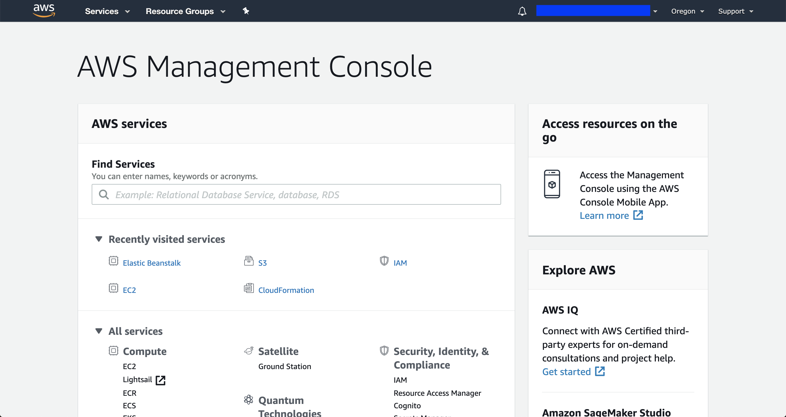
    - 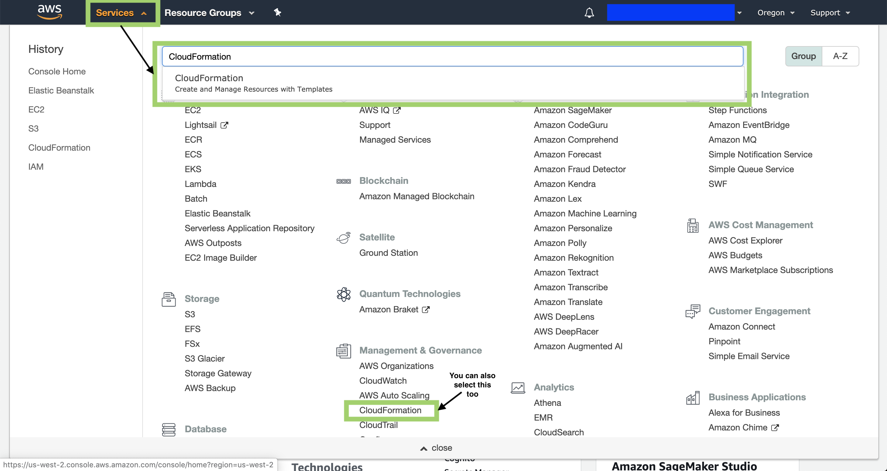
1. Select `Create Stack`
    - 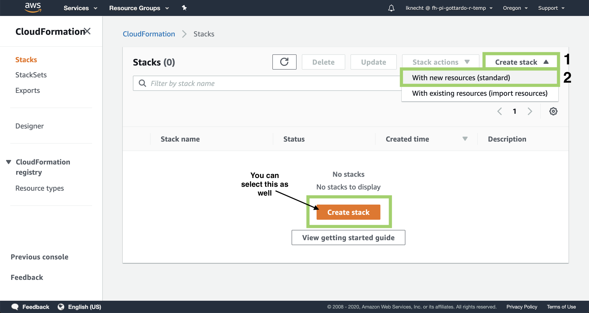
    - 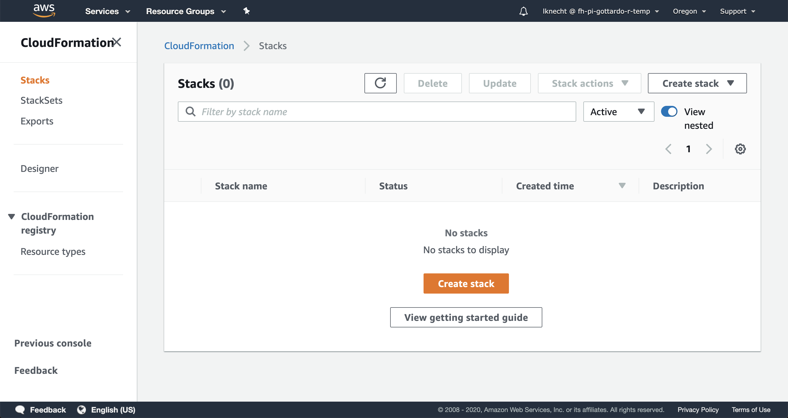
1. Select template
    - For `Prerequisite - Prepare template`
      Select `Template is ready`
    - For `Specify template`
        - Select `Upload a template file`
        - Select `Choose file` and use the [nextflow_cloud_formation.yml](continuous_integration/aws_cloud_formation/nextflow_cloud_formation.yml) in this repository
    - Then select `Next`
    - 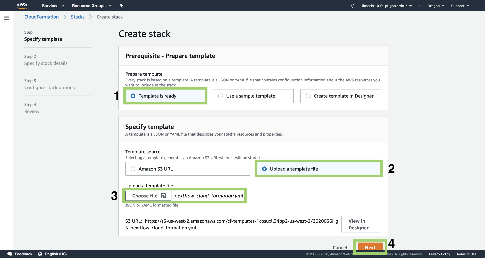
1. Set any desired parameters for the cloud formation
    - Using the default settings is suggested for the quick-start
    - Please see [documentation/HOW_TO_USE_THE_NEXTFLOW_AWS_CLOUD_FORMATION_FILE.md](documentation/HOW_TO_USE_THE_NEXTFLOW_AWS_CLOUD_FORMATION_FILE.md) for a detailed explanation on how to use these
    - 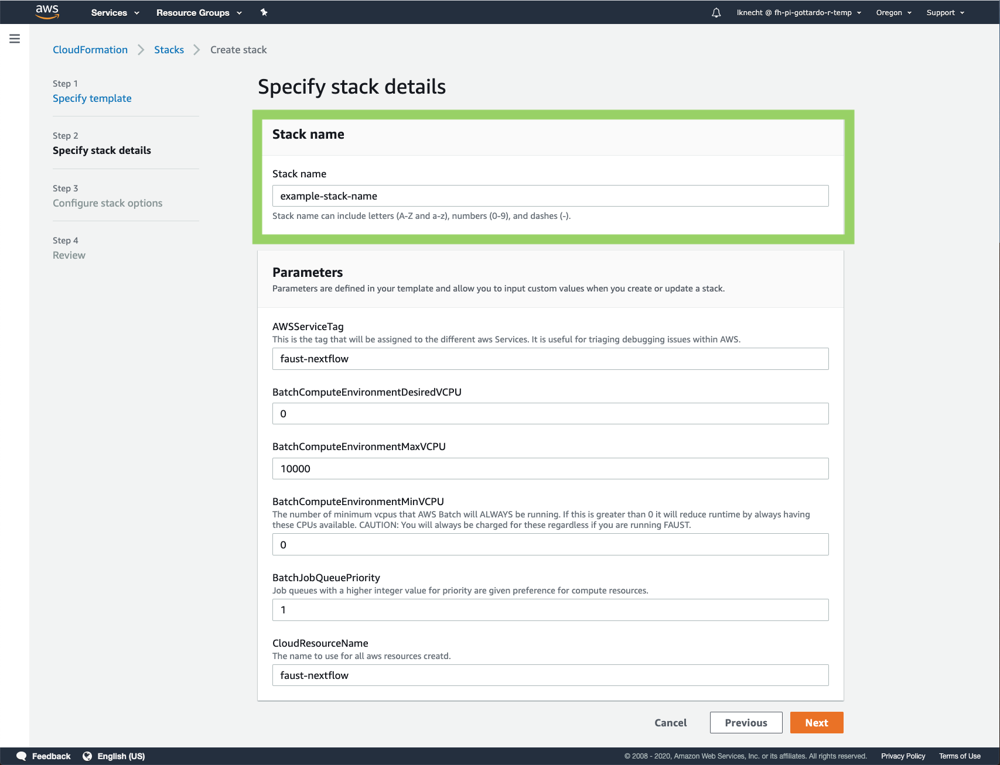
1. Set any desired stack options
    - 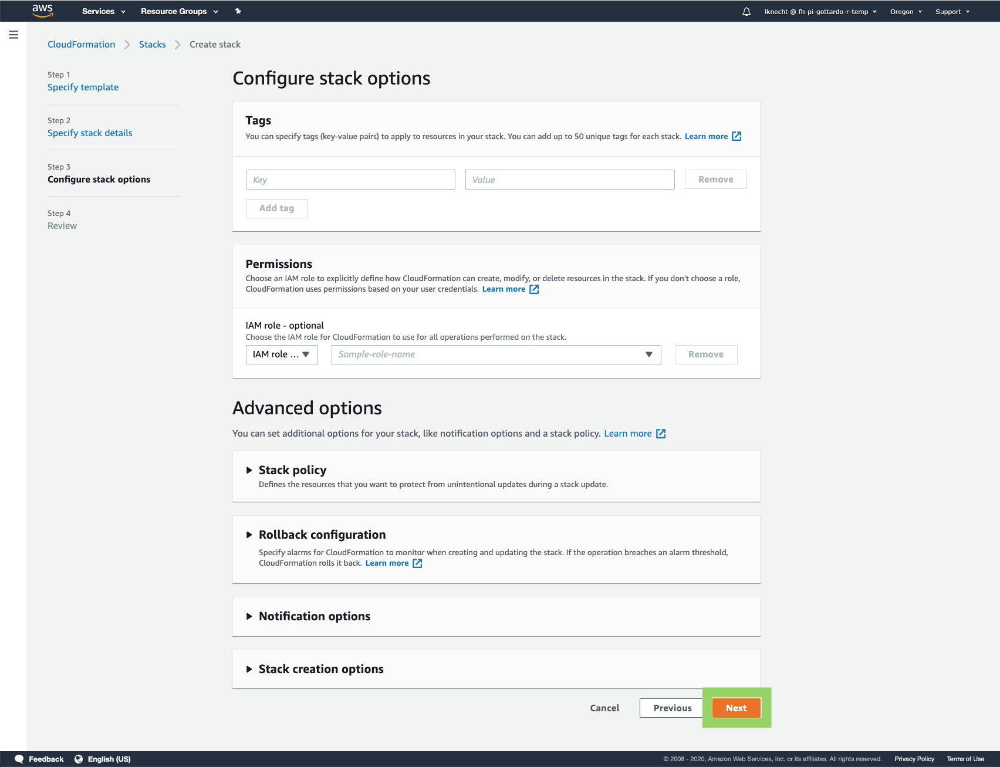
1. Create the stack
    - 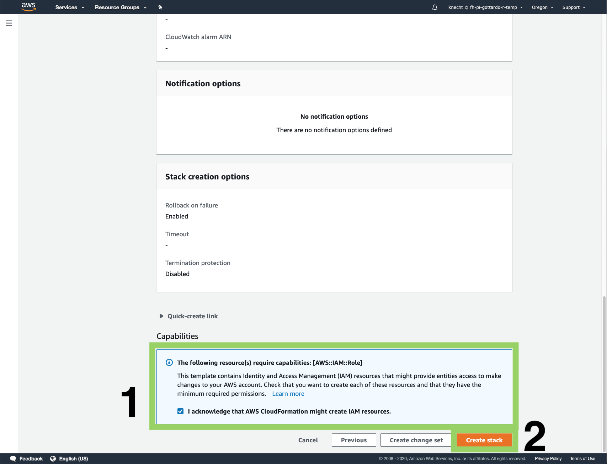
1. Wait for the stack to complete
    - If you encounter any issues or errors, see the [documentation/HOW_TO_USE_THE_NEXTFLOW_AWS_CLOUD_FORMATION_FILE.md `Possible Errors` Section](documentation/HOW_TO_USE_THE_NEXTFLOW_AWS_CLOUD_FORMATION_FILE.md#Possible-Errors) for more information
    - 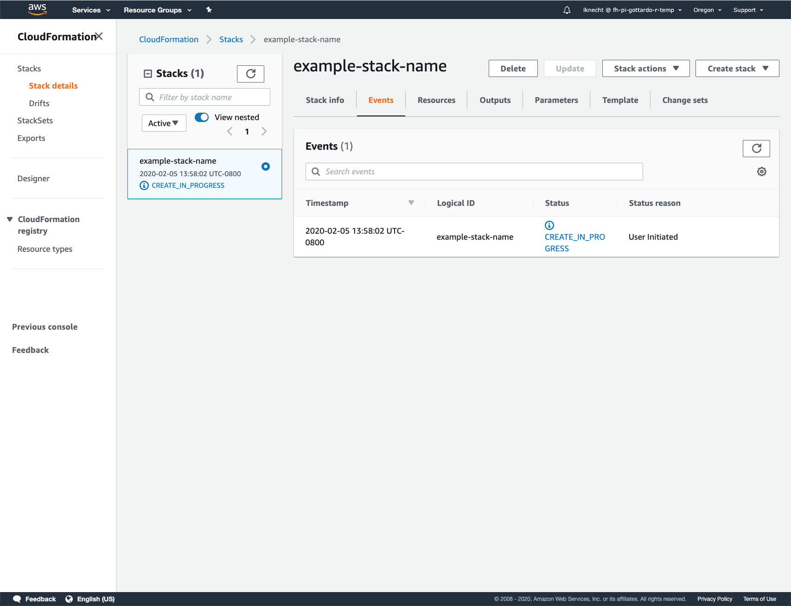
    - 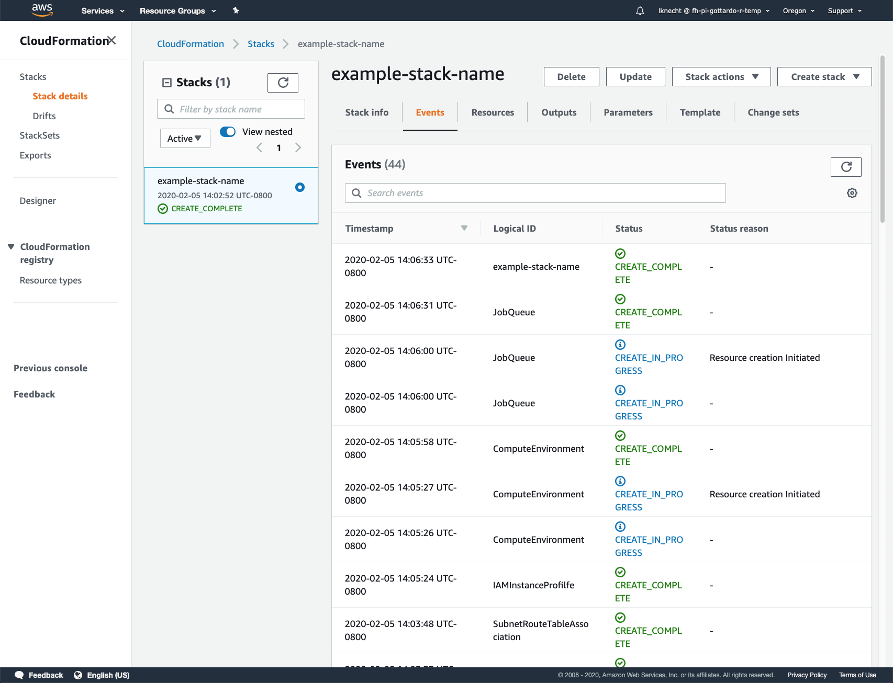

## Run `FAUST` using the AWS configurations

### Template Example

-   ⚠️ **Warning** Execute this using the `nextflow run` command, or execute this from repository's root directory
-   `generate_annotations`
    -   ```bash
        ./nextflow run main.nf -profile aws \
                                --active_channels_path [PATH_TO_ACTIVE_CHANNELS_RDS_FILE] \
                                --channel_bounds_path [PATH_TO_CHANNEL_BOUNDS_RDS_FILE] \
                                --supervised_list_path [PATH_TO_SUPERVISED_LIST_RDS_FILE] \
                                --input_gating_set_directory [PATH_TO_A_DIRECTORY_CONTAINING_FLOW_WORKSPACE_GATING_SET_FILES] \
                                --command generate_annotations
        ```
-   `discover_phenotypes`
    -   ```bash
        ./nextflow run main.nf -profile aws \
                                --active_channels_path [PATH_TO_ACTIVE_CHANNELS_RDS_FILE] \
                                --channel_bounds_path [PATH_TO_CHANNEL_BOUNDS_RDS_FILE] \
                                --supervised_list_path [PATH_TO_SUPERVISED_LIST_RDS_FILE] \
                                --input_gating_set_directory [PATH_TO_A_DIRECTORY_CONTAINING_FLOW_WORKSPACE_GATING_SET_FILES] \
                                --command discover_phenotypes
        ```

### Actual Example

-   `generate_annotations`
    -   ```bash
        ./nextflow run main.nf -profile aws \
                                --active_channels_path ~/Desktop/nextflow_testing/helper_files/active_channels.rds \
                                --channel_bounds_path ~/Desktop/nextflow_testing/helper_files/channel_bounds.rds \
                                --supervised_list_path ~/Desktop/nextflow_testing/helper_files/supervised_list.rds \
                                --input_gating_set_directory ~/Desktop/nextflow_testing/dataset \
                                --command generate_annotations
        ```
-   `discover_phenotypes`
    -   ```bash
        ./nextflow run main.nf -profile aws \
                                --active_channels_path ~/Desktop/nextflow_testing/helper_files/active_channels.rds \
                                --channel_bounds_path ~/Desktop/nextflow_testing/helper_files/channel_bounds.rds \
                                --supervised_list_path ~/Desktop/nextflow_testing/helper_files/supervised_list.rds \
                                --input_gating_set_directory ~/Desktop/nextflow_testing/dataset \
                                --command discover_phenotypes
        ```

## Wait for processing to complete

`FAUST Nextflow` will be processing at this point, please wait for it to complete.

## Collect results from the `FAUST_RESULTS` directory

This is generated at the end of the `FAUST Nextflow`'s execution

# Additional Documentation

You may be interested in reading more about `FAUST` or `FAUST Nextflow`

## User Oriented Information

| Product        | Document                                                                                                                 | Description                                                                                                                                                                                                                                       |
| -------------- | ------------------------------------------------------------------------------------------------------------------------ | ------------------------------------------------------------------------------------------------------------------------------------------------------------------------------------------------------------------------------------------------- |
| Flow Workspace | [Flow Workspace GitHub Repository](https://github.com/RGLab/flowWorkspace)                                               | This is the `FlowWorkspace` library that contains a [`GatingSet`](https://github.com/RGLab/flowWorkspace/blob/trunk/R/AllClasses.R#L75) data structure. `FAUST` expects the `input_gating_set` parameter to be this data structure saved to disk. |
| FAUST          | [FAUST GitHub Repository](https://github.com/rglab/faust)                                                                | This is the implementation of `FAUST` that `FAUST Nextflow` uses                                                                                                                                                                                  |
| FAUST_Nextflow | [HOW_TO_USE_THE_NEXTFLOW_AWS_CLOUD_FORMATION_FILE.md](documentation/HOW_TO_USE_THE_NEXTFLOW_AWS_CLOUD_FORMATION_FILE.md) | A guide to explain creating `AWS` Infrastructure using the `AWS CloudFormation` file                                                                                                                                                              |
| FAUST_Nextflow | [HOW_TO_USE_FAUST_NEXTFLOW.md](documentation/HOW_TO_USE_FAUST_NEXTFLOW.md)                                               | A guide to explaing how to run `FAUST Nextflow`                                                                                                                                                                                                   |

## Developer Oriented Information

| Product        | Document                                                                                                                     | Description                                                                                                                            |
| -------------- | ---------------------------------------------------------------------------------------------------------------------------- | -------------------------------------------------------------------------------------------------------------------------------------- |
| FAUST_Nextflow | [HOW_TO_BUILD_THE_NEXTFLOW_AWS_ENVIRONMENT.md](documentation/HOW_TO_BUILD_THE_NEXTFLOW_AWS_ENVIRONMENT.md)                   | A guide to explain how to create the correct architecture in `AWS` for `Nextflow` to run                                               |
| FAUST_Nextflow | [HOW_TO_BUILD_THE_NEXTFLOW_AWS_CLOUD_FORMATION_FILE.md](documentation/HOW_TO_BUILD_THE_NEXTFLOW_AWS_CLOUD_FORMATION_FILE.md) | A guide to explain how to use our provided `AWS CloudFormation` file to create the required `AWS` architecture to run `FAUST Nextflow` |
| FAUST_Nextflow | [HOW_TO_BUILD_THE_FAUST_NEXTFLOW_DOCKER_IMAGE.md](documentation/HOW_TO_BUILD_THE_FAUST_NEXTFLOW_DOCKER_IMAGE.md)             | A guide to explain how to create the `Docker` image that `Nextflow` needs to run `FAUST`                                               |
| FAUST_Nextflow | [NEXTFLOW_GOTCHAS.md](documentation/NEXTFLOW_GOTCHAS.md)                                                                     | A guide covering some unexpected functionality when working with `Nextflow`                                                            |
