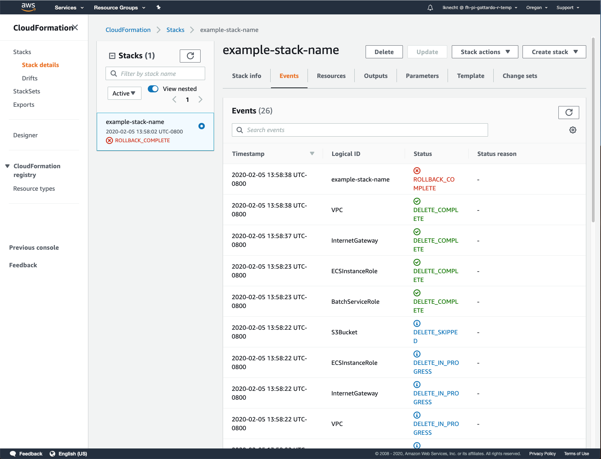
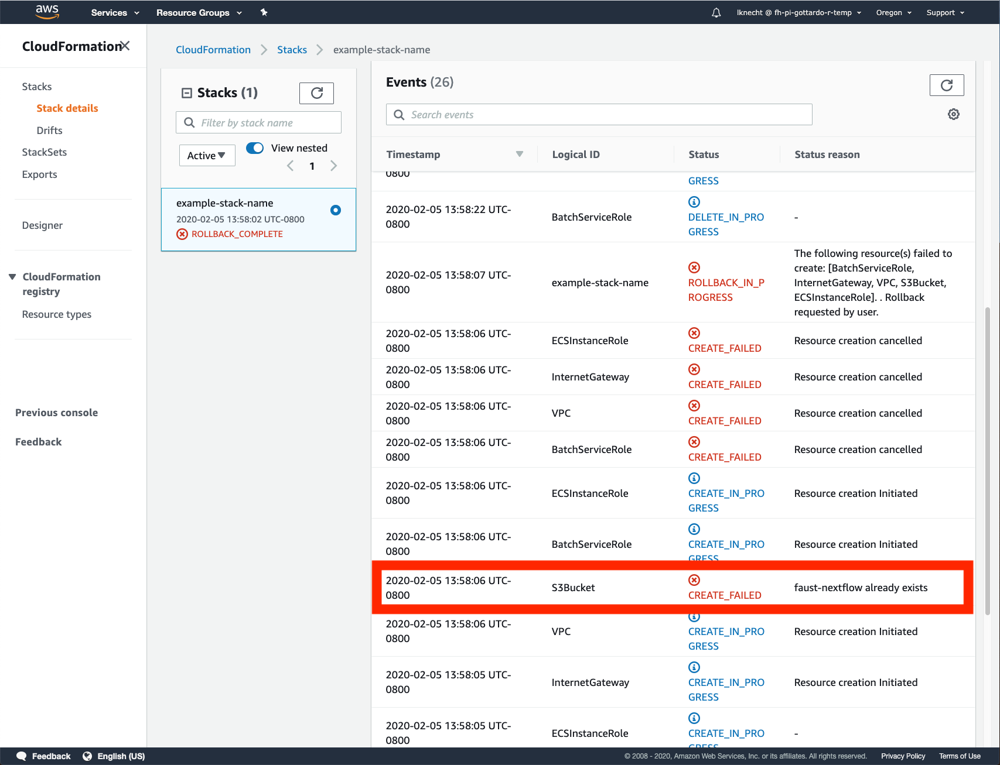

# Overview

This document explains how to use the `AWS CloudFormation` file in this repository to create your own `AWS` architecture that will support running `FAUST Nextflow`

# Table of Contents

<!-- START doctoc generated TOC please keep comment here to allow auto update -->
<!-- DON'T EDIT THIS SECTION, INSTEAD RE-RUN doctoc TO UPDATE -->

-   [Possible Errors](#possible-errors)
    -   [Stack Creation Failed - AWS S3 Bucket Already Exists](#stack-creation-failed---aws-s3-bucket-already-exists)
        -   [Problem](#problem)
        -   [Solution](#solution)

<!-- END doctoc generated TOC please keep comment here to allow auto update -->

# Possible Errors

## Stack Creation Failed - AWS S3 Bucket Already Exists

### Problem

`Cloud Formation` does not provide a mechanism to delete `AWS S3 buckets` automatically on delete. As a result, the `S3 buckets` you used will persist after the stack is deleted.

If you try to create a new stack without deleting the previous `S3 bucket` it will cause cloud formation to fail because it cannot create something that alread exists

-   

-   

### Solution

Go to the `AWS S3` service, then `empty` and `delete` the bucket
